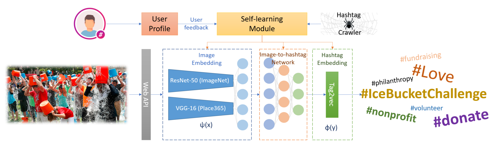
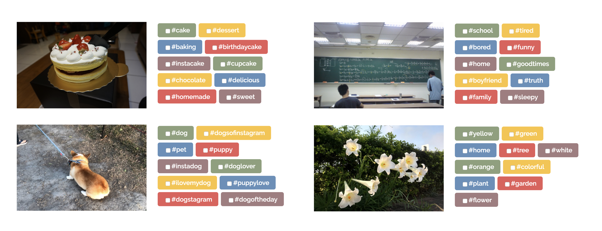
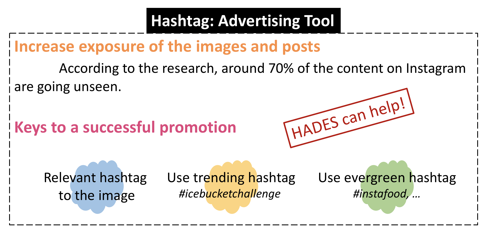

# HADES: HAshtag Recommendation via DEep Learning for Images in Social Networks
[HADES](http://www.imagehashtag.com/)(HAshtag recommendation system via DEep learning for images in Social networks) is a recommendation system that users can upload images and receive 10 most relevant hashtags based on the content of the image. The homepage of HADES is shown below. In HADES, we develop several methods to effectively combine image classifiers and NLP models. Besides, HADES can crawl and learn latest tags online, collect user feedback, and automatically update its image classifiers as well as hashtag embedding.


## Architecture
The architecture of HADES is shown below. Our system is mainly built by Node.js, MongoDB and Python. There are four major components: image embedding, hashtag embedding, image-hashtag network, and self-learning module.


## Model
The model used in HADES is saved in [HashtagRec/Hashtag_end2end/](hades_web/HashtagRec/Hashtag_end2end/).

## Website
### Structure of Web server
- Front-end: Jade + Javascript
- Back-end: Node.js + Express + npm
- Database: Mongodb

### Usage
Installation
- [nodejs and npm](http://tecadmin.net/install-latest-nodejs-npm-on-ubuntu/)
- [Express](http://expressjs.com/zh-tw/starter/installing.html)
- [MongoDB](https://docs.mongodb.com/manual/tutorial/install-mongodb-enterprise-on-ubuntu/)

Build on linux 
```c
$ ./Build.sh
```

## Recommendation Results


## Applications
Recently, hashtags are important advertising tools especially for images. Using right hashtags can gain a lot of exposure and effectively promote one’s own brand. The following figure shows several keys to a successful promotion which HAEDS can help, according to [How to Grow Your Audience With Hashtags for Instagram](https://sproutsocial.com/insights/hashtags-for-instagram/).

